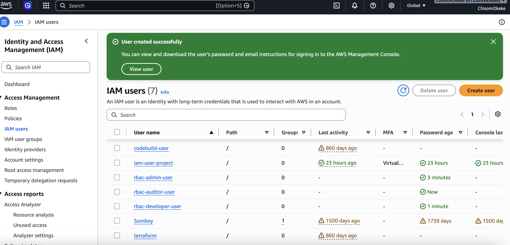
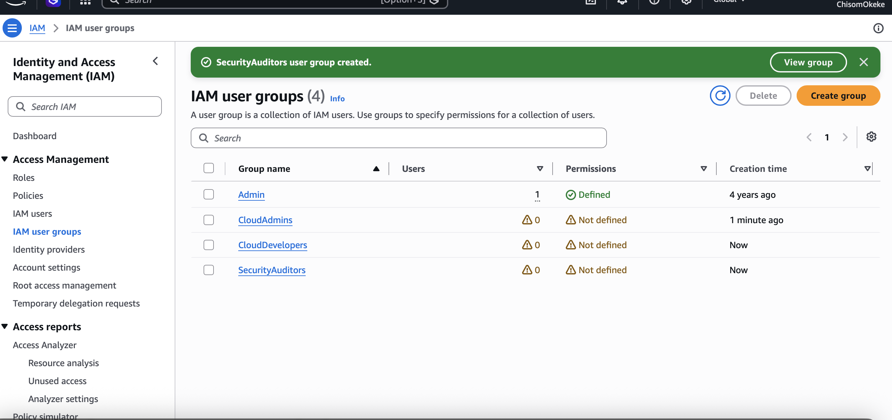
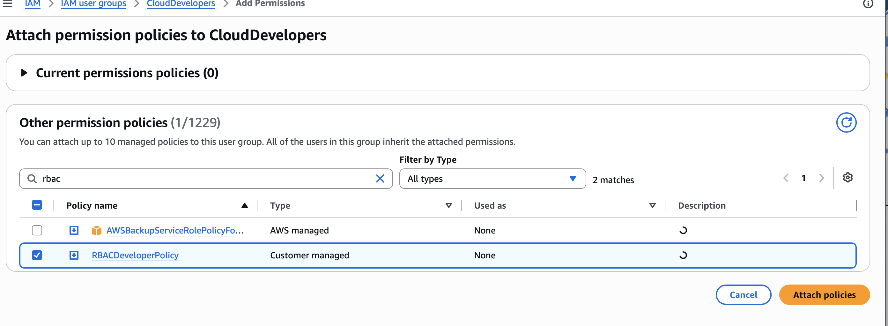
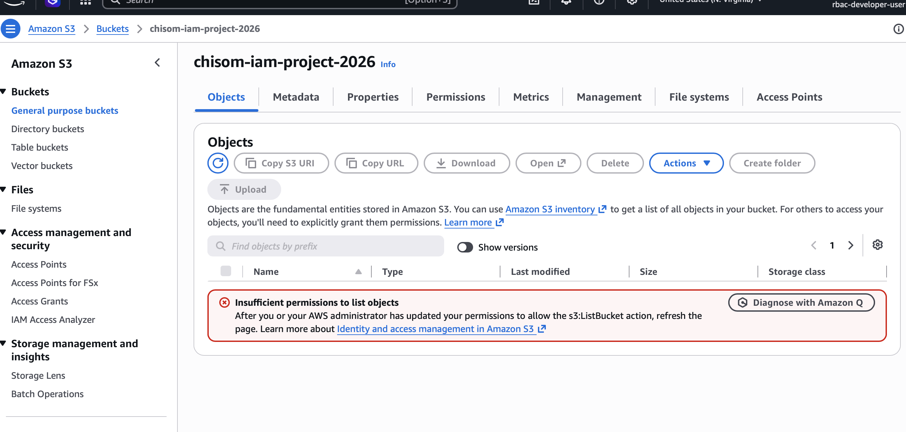
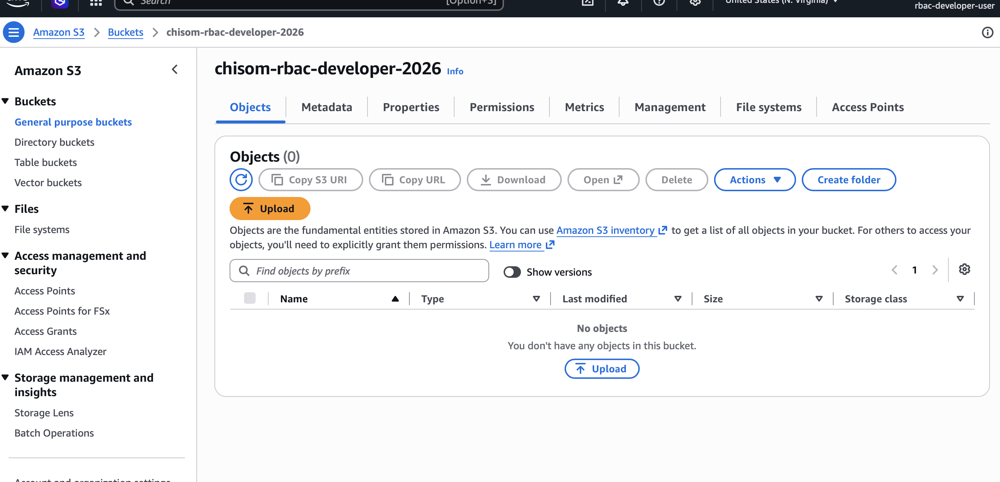
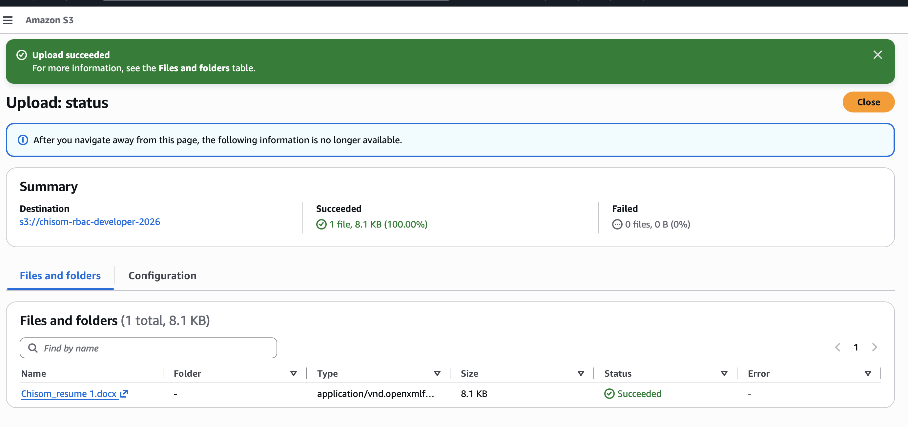
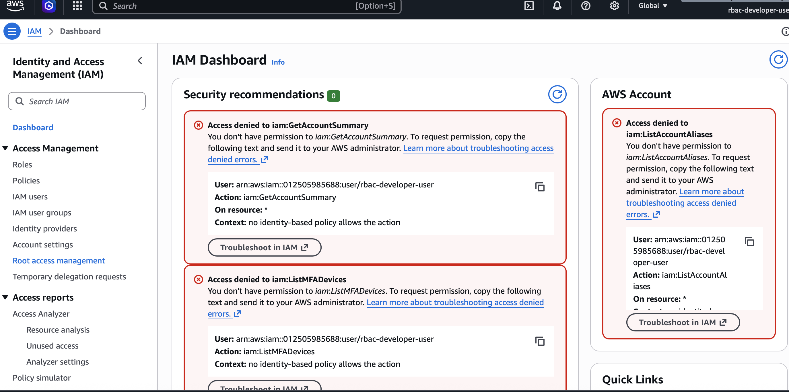
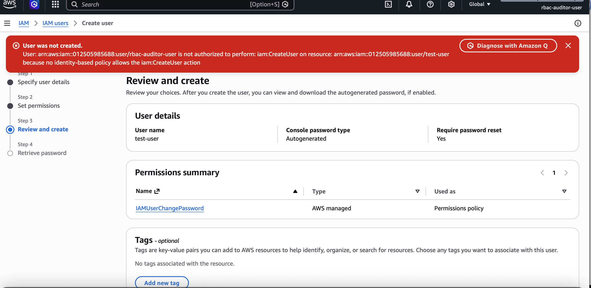
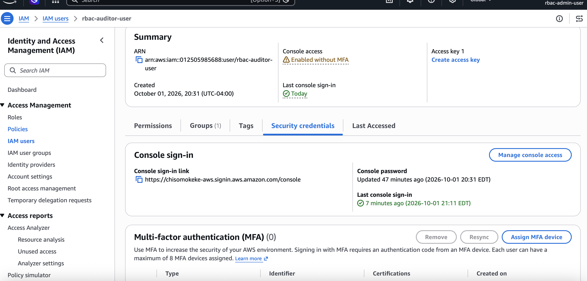

# AWS Role-Based Access Control (RBAC) Security Project

## Project Overview

This project demonstrates the implementation of Role-Based Access
Control (RBAC) in AWS using IAM users, IAM groups, AWS-managed policies,
customer-managed policies, Amazon S3, Amazon EC2, and AWS CloudTrail.

Three different job functions were implemented:

- Administrator
- Developer
- Security Auditor

Permissions were assigned according to job responsibilities to
demonstrate least privilege and separation of duties.

---

## Architecture

---

## AWS Services Used

- AWS Identity and Access Management (IAM)
- Amazon S3
- Amazon EC2
- AWS CloudTrail

---

# Implementation

## 1. IAM Users Created

Three IAM users were created representing different organizational
job functions:

- rbac-admin-user
- rbac-developer-user
- rbac-auditor-user

---

## 2. IAM Groups Created

Three IAM groups were created to provide permissions based on
job responsibilities:

- CloudAdmins
- CloudDevelopers
- SecurityAuditors

Users were assigned to their corresponding groups.

---

## 3. Developer Least-Privilege Policy

A customer-managed IAM policy was created for the Developer role.

The policy provides controlled access to EC2 and a designated
S3 development bucket without granting IAM administrative privileges.

---

## 4. Developer Policy Assigned to Group

The custom Developer policy was attached to the CloudDevelopers
IAM group.

This allows permissions to be managed at the group level rather
than assigning permissions directly to individual users.

---

# Permission Testing

## 5. Developer Denied Access to Unauthorized S3 Bucket

The Developer user attempted to access an S3 bucket outside the
authorized development environment.

Access was denied as expected, demonstrating resource-level
least-privilege enforcement.

---

## 6. Developer Authorized to Access Development Bucket

The same Developer user successfully accessed the designated
development S3 bucket.

This confirms that the policy allows access to authorized resources
while restricting unauthorized resources.

---

## 7. Developer Successfully Uploads Object to S3

The Developer user successfully uploaded an object to the authorized
development bucket.

This validates the `s3:PutObject` permission defined by the
Developer IAM policy.

---

## 8. Developer Denied IAM Administration

The Developer attempted to access IAM administrative functionality.

Access was denied because the Developer policy does not provide
IAM administration permissions.

This demonstrates separation between application-development
permissions and identity-administration privileges.

---

## 9. Security Auditor Cannot Create IAM Resources

The Security Auditor was configured using security-auditing
permissions.

The Auditor can inspect security-related configuration but cannot
perform unauthorized IAM administrative operations such as creating
users.

The attempted administrative action was denied as expected.

---

## 10. Administrator Access

The Administrator user was assigned privileged administrative
permissions for the lab environment.

Testing demonstrated the difference between administrative access
and the restricted Developer and Security Auditor roles.

---

# RBAC Access Model

| Role | S3 Development Bucket | Other S3 Buckets | EC2 | IAM Administration |
|---|---|---|---|---|
| Administrator | Full Access | Full Access | Full Access | Full Access |
| Developer | Authorized Access | Denied | Limited Operations | Denied |
| Security Auditor | Audit/Read Access* | Audit/Read Access* | Audit/Read Access* | Modification Denied |

\* Exact read visibility is determined by the AWS-managed
`SecurityAudit` policy.

---

# Security Concepts Demonstrated

- Role-Based Access Control (RBAC)
- Principle of Least Privilege
- Separation of Duties
- IAM Users
- IAM Groups
- AWS-Managed IAM Policies
- Customer-Managed IAM Policies
- Resource-Level Permissions
- Amazon S3 Access Control
- EC2 Permission Management
- Positive Authorization Testing
- Negative Authorization Testing
- Security Auditing

---

# Key Security Findings

The testing demonstrated that AWS IAM policies can enforce different
levels of access according to organizational job responsibilities.

The Developer could access the designated development S3 bucket and
perform authorized operations while being prevented from accessing
unauthorized S3 resources and IAM administration.

The Security Auditor could perform security-oriented inspection while
administrative modification remained restricted.

The Administrator maintained privileged access required for
administrative operations.

This demonstrates how RBAC, least privilege, and separation of duties
can reduce unnecessary access within an AWS environment.
